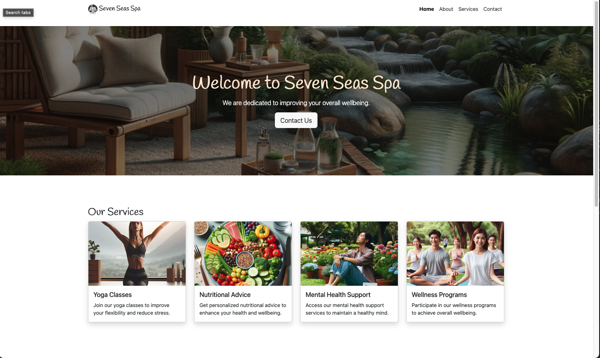

 
 

# Seven Seas Spa

## Introduction 

Seven Seas Spa is a responsive AI Pair Programming 1 project developed as part of the Code Institute Full Stack Software Development For The AI Augmented Developer Bootcamp, consisting of learning outcomes that utilise HTML5, CSS3,  Bootstrap 5.3.3 and GitHub Copilot.

The LIVE PROJECT can found here: <a href="https://gerbil1511.github.io/seven-seas-spa/" target="_blank">Seven Seas Spa</a>

## Credits

### Code

Project and primary learning supplied by [Code Institute](https://codeinstitute.net/ie/) 